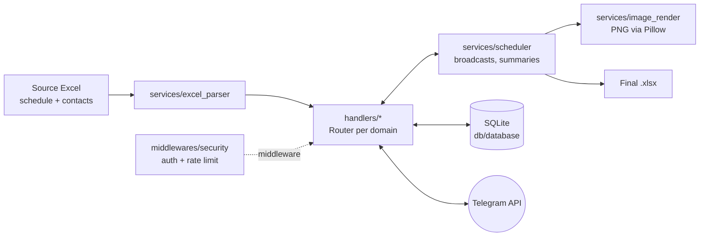

[English](README.md) | [Русский](README.ru.md)

# Duty Bot — Telegram bot for on-call schedule coordination


A bot that automates weekly on-call (duty) schedule sign-off for an engineering team.

**The problem.** The process used to be fully manual: an admin messaged every
engineer, collected replies across chats, negotiated substitutions and merged
everything into Excel. Sign-off took hours every week, replies got lost and
nobody could tell the current state of substitutions.

**The solution.** The bot broadcasts a poll built from the Excel schedule.
Engineers answer with buttons (confirm / decline / hand projects over to a
substitute), the bot drives the substitution approval chains, shows the admin
a live summary and produces the final schedule — as an Excel file and as a
PNG image published to everyone.

## Demo

The final schedule image the bot publishes to participants (all data is fictional):


## Features

**Polls and substitutions**
- Poll broadcast to all engineers on duty for the week — in parallel
  (`asyncio.gather`)
- State is tracked per **(engineer, project) pair**: one person can hand
  different projects to different substitutes via a checklist UI
- Approval chains: a substitute accepts/declines the whole package; on
  decline the initiator chooses — keep the projects, pass them to someone
  else, or refuse; a per-project limit of 3 declines with anti-ping-pong
  protection (a candidate who declined a project is never offered it again)
- Double-answer protection + auto-dismissal of duplicated poll messages
- Reminders for non-responders, throttled to once per 30 minutes
- Planned substitutions in advance (vacation / business trip) with candidate
  consent — applied automatically when a poll for that period starts

**Administration**
- Registration only via a request approved by the admin (whitelist access
  model)
- Live poll summary: blocks strictly by status, counters, one-tap reset
  buttons that re-deliver the poll to a participant
- "Top-up" delivery to late joiners, personal poll delivery, poll
  cancellation that invalidates all active buttons
- Contact directory import from Excel with automatic DB backup (10-copy
  rotation)

**Output**
- Final schedule as .xlsx (openpyxl): grouped by the resulting duty officer,
  uncovered slots highlighted in red
- PNG schedule (Pillow): table with zebra striping, project list wrapping and
  Cyrillic support; cached by a state hash — re-rendered only when someone
  actually answered
- One-click publishing of the schedule image to every registered user

**Reliability and security**
- SQLite in WAL mode over a single shared connection (`busy_timeout`,
  foreign-key enforcement); writes serialised with an asyncio lock,
  hot-path queries covered by indexes
- Namesake-safe contact imports: ambiguous full-name matches are skipped
  and reported to the admin instead of silently merging two people
- Rate limiting: 20 messages/min, 5 commands/sec, 5-minute auto-ban
- Parameterised SQL only; HTML escaping of all user input; control-character
  sanitisation
- Excel validation before import (size, structure, `data_only=True` — no
  formula execution)
- User-id masking in the security log, separate `security.log`
- Global error handler: neutral message to the user, full traceback to logs
- People search: case-insensitive, Cyrillic Е/Ё-insensitive, word order
  independent, @tag lookup

## Tech stack

- **Python 3.10+** — asyncio, FSM
- **aiogram 3.13** — Telegram Bot API, inline keyboards, middlewares, routers
- **aiosqlite** — async SQLite
- **openpyxl** — source schedule parsing, final .xlsx generation
- **Pillow** — PNG schedule rendering
- **python-dotenv** — configuration via environment variables

## Architecture



Data flow of one poll:

```
Excel (weekly schedule)
  → poll to engineers (buttons: confirm / decline / substitute)
    → per-(engineer, project) status in SQLite
      → live summary for the admin
        → final schedule: .xlsx + PNG for everyone
```

Project layout (standard aiogram 3.x structure):

| Path | Responsibility |
|---|---|
| `bot.py` | Thin entry point: middlewares, router wiring, polling |
| `config.py` | `.env` loading and validation |
| `app/loader.py` | `Bot` / `Dispatcher` instances, logging setup |
| `app/states.py` | FSM states |
| `app/handlers/` | One router per domain: linking, admin accounts, menu, poll lifecycle, live summaries, schedule output, duty responses & substitution engine, planned substitutions |
| `app/keyboards/` | Inline keyboard factories (menus, linking, duty, admin) |
| `app/services/` | scheduler, excel_parser, image_render, notify |
| `app/db/` | SQLite schema, migrations, CRUD |
| `app/middlewares/` | auth whitelist + rate limiting |

## Running locally

1. Clone and install dependencies:

   ```bash
   git clone https://github.com/imkelli/duty-scheduler-bot.git
   cd duty-scheduler-bot
   python -m venv .venv
   # Windows: .venv\Scripts\activate   Linux/macOS: source .venv/bin/activate
   pip install -r requirements.txt
   ```

2. Create a bot via [@BotFather](https://t.me/BotFather) and get a token.

3. Configure the environment:

   ```bash
   cp .env.example .env
   # fill in BOT_TOKEN and ADMIN_ID (your user id — ask @userinfobot)
   ```

   `EXCEL_FILE` points to the demo schedule `examples/schedule_demo.xlsx`
   by default (generated by `docs/generate_demo.py`, fictional data).

4. For PNG rendering put a font into `assets/` — see [assets/README.md](assets/README.md).

5. Run:

   ```bash
   python bot.py
   ```

6. In Telegram: `/start` as the admin → full menu. Import contacts
   (`Импорт данных`), start a poll (`Запустить дежурство`) — the bot begins
   collecting answers.

### Source Excel format

- **A sheet named after the year** (e.g. `2026`): column A — projects,
  row 1 — week periods as `DD.MM - DD.MM`, cells — duty engineers' names.
- **A `Phones` sheet**: full name | phone (+email) | Telegram tag.

See `examples/schedule_demo.xlsx` for a reference structure.

## License

[MIT](LICENSE)
