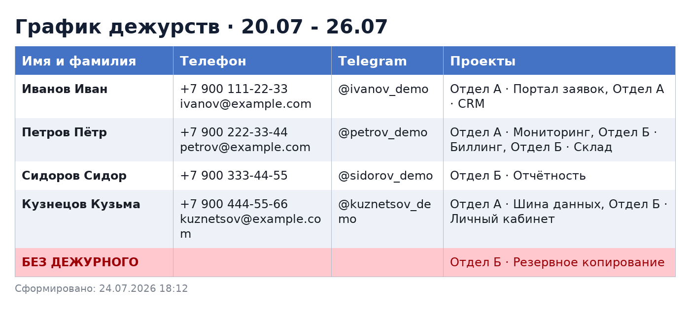
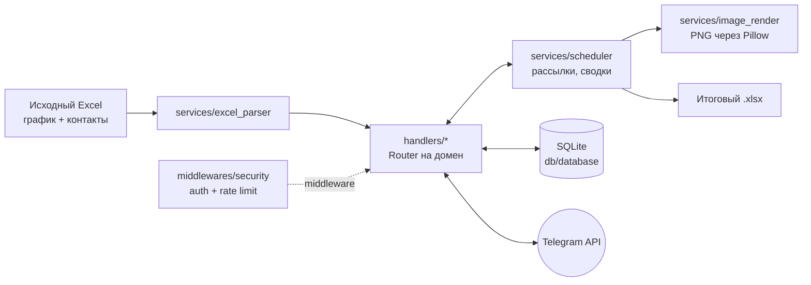

[English](README.md) | [Русский](README.ru.md)

# Duty Bot — Telegram-бот согласования графика дежурств


Бот автоматизирует еженедельное согласование дежурств в команде инженеров.

**Проблема.** Раньше процесс был полностью ручным: администратор писал каждому
инженеру, собирал ответы в переписках, договаривался о подменах и сводил всё
в Excel. На неделю согласования уходили часы, ответы терялись, статус подмен
никто не отслеживал.

**Решение.** Бот рассылает опрос по графику из Excel, инженеры отвечают
кнопками (подтвердить / отказаться / передать проекты замене), бот ведёт
цепочки согласования подмен, показывает администратору живую сводку и
формирует итоговый график — Excel-файлом и PNG-картинкой для всех участников.

## Пример работы

Итоговый график, который бот публикует участникам (данные вымышленные):



## Возможности

**Опросы и подмены**
- Рассылка опроса всем дежурным недели — параллельно (`asyncio.gather`)
- Статус ведётся на уровне пары **«инженер + проект»**: один человек может
  передать разные проекты разным заменам через чек-лист с галочками
- Цепочки согласования: замена принимает/отклоняет пакет проектов целиком,
  при отказе инициатор выбирает — взять на себя, передать другому или
  отказаться; лимит 3 отказа на проект с защитой от «пинг-понга»
  (отказавшемуся кандидату тот же проект повторно не предлагается)
- Защита от двойного ответа + гашение продублированных сообщений опроса
- Напоминания неответившим с троттлингом (не чаще раза в 30 минут)
- Плановые замены «на будущее» (отпуск/командировка) с согласием кандидата —
  применяются автоматически при запуске опроса на период

**Администрирование**
- Регистрация только через заявку с одобрением администратора
  (whitelist-модель доступа)
- Живая сводка опроса: блоки строго по статусам, счётчики, кнопки
  точечного сброса ответа с переотправкой опроса
- «Дослать опрос» опоздавшим, персональная отправка конкретному человеку,
  отмена опроса с инвалидацией всех активных кнопок
- Импорт справочника контактов из Excel с автобэкапом БД (ротация 10 копий)

**Результат**
- Итоговый график в .xlsx (openpyxl): группировка по итоговому дежурному,
  слоты без дежурного подсвечены красным
- PNG-график (Pillow): таблица с зеброй, переносом длинных списков проектов,
  кириллицей; кэширование по хэшу состояния — перерисовка только когда
  кто-то реально ответил
- Публикация графика всем зарегистрированным в один клик

**Надёжность и безопасность**
- SQLite в режиме WAL через одно общее соединение (`busy_timeout`,
  контроль внешних ключей); запись сериализуется asyncio-локом,
  горячие запросы покрыты индексами
- Импорт контактов безопасен для тёзок: неоднозначные совпадения по ФИО
  пропускаются и показываются администратору, а не склеивают двух людей
- Rate limiting: 20 сообщений/мин, 5 команд/сек, автобан на 5 минут
- Только параметризованные SQL-запросы; HTML-экранирование любого
  пользовательского ввода; санитайзинг контрольных символов
- Валидация Excel перед импортом (размер, структура, `data_only=True` —
  формулы не выполняются)
- Маскирование user_id в логах безопасности, отдельный `security.log`
- Глобальный error-handler: пользователю нейтральное сообщение, полный
  трейс — в лог
- Поиск людей: регистронезависимый, Е/Ё-нечувствительный, порядок слов
  не важен, поиск по @тегу

## Стек технологий

- **Python 3.10+** — asyncio, FSM
- **aiogram 3.13** — Telegram Bot API, inline-клавиатуры, middlewares, роутеры
- **aiosqlite** — асинхронный SQLite
- **openpyxl** — чтение исходного графика, генерация итогового .xlsx
- **Pillow** — рендер графика в PNG
- **python-dotenv** — конфигурация через переменные окружения

## Архитектура



Поток данных одного опроса:

```
Excel (график недели)
  → опрос инженерам (кнопки: подтвердить / отказ / замена)
    → статусы по каждой паре «инженер + проект» в SQLite
      → живая сводка администратору
        → итоговый график: .xlsx + PNG всем участникам
```

Структура проекта (стандартная для aiogram 3.x):

| Путь | Ответственность |
|---|---|
| `bot.py` | Тонкая точка входа: middlewares, подключение роутеров, polling |
| `config.py` | Загрузка и валидация `.env` |
| `app/loader.py` | Экземпляры `Bot` / `Dispatcher`, настройка логирования |
| `app/states.py` | FSM-состояния |
| `app/handlers/` | Роутер на домен: регистрация, админ-аккаунты, меню, жизненный цикл опроса, живые сводки, выгрузки графика, ответы дежурных и движок подмен, плановые замены |
| `app/keyboards/` | Фабрики inline-клавиатур (menus, linking, duty, admin) |
| `app/services/` | scheduler, excel_parser, image_render, notify |
| `app/db/` | Схема SQLite, миграции, CRUD |
| `app/middlewares/` | Whitelist-доступ + rate limiting |

## Запуск локально

1. Клонировать и установить зависимости:

   ```bash
   git clone https://github.com/imkelli/duty-scheduler-bot.git
   cd duty-scheduler-bot
   python -m venv .venv
   # Windows: .venv\Scripts\activate   Linux/macOS: source .venv/bin/activate
   pip install -r requirements.txt
   ```

2. Создать бота у [@BotFather](https://t.me/BotFather), получить токен.

3. Настроить окружение:

   ```bash
   cp .env.example .env
   # заполнить BOT_TOKEN и ADMIN_ID (свой user_id — узнать у @userinfobot)
   ```

   `EXCEL_FILE` по умолчанию указывает на демо-график
   `examples/schedule_demo.xlsx` (сгенерирован `docs/generate_demo.py`,
   данные вымышленные).

4. Для PNG-графика положить шрифт в `assets/` — см. [assets/README.md](assets/README.md).

5. Запустить:

   ```bash
   python bot.py
   ```

6. В Telegram: `/start` от имени администратора → полное меню.
   Импортировать контакты («Импорт данных»), запустить опрос
   («Запустить дежурство») — бот начнёт собирать ответы.

### Формат исходного Excel

- **Лист с именем года** (например, `2026`): колонка A — проекты,
  строка 1 — периоды недель `DD.MM - DD.MM`, в ячейках — ФИО дежурных.
- **Лист `Phones`**: ФИО | телефон (+email) | Telegram-тег.

Пример структуры — в `examples/schedule_demo.xlsx`.

## Лицензия

[MIT](LICENSE)
